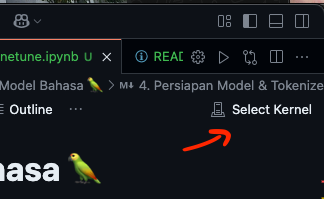
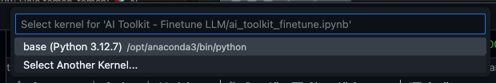
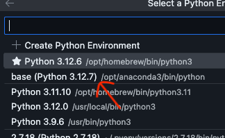
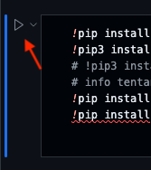

# 🦜 **AI Toolkit** - <span style="background: linear-gradient(to right,rgb(252, 142, 79), #FF87E1); -webkit-background-clip: text; color: transparent;">Tutorial Fine-Tuning Model Bahasa</span>

Relevan (April 2025)


## 📌 Deskripsi Proyek
Tutorial ini akan memandu Anda melalui proses fine-tuning model bahasa DistilBERT untuk analisis sentimen menggunakan dataset IMDB.

## 🛠 Prasyarat (Prerequisites)

### 1. **Pengetahuan Dasar**
- Pemahaman dasar Python (variabel, fungsi, class)
- Konsep machine learning sederhana (training, evaluation)
- Familiar dengan Jupyter Notebook (opsional tapi direkomendasikan)

### 2. **Spesifikasi Sistem**
| Komponen | Persyaratan Minimal | Rekomendasi |
|----------|---------------------|-------------|
| OS       | Windows 10/macOS 10.13+/Linux Ubuntu 18.04+ | Linux Ubuntu 20.04+ |
| RAM      | 8GB                 | 16GB atau lebih |
| GPU      | Tidak wajib (bisa CPU) | NVIDIA GPU dengan CUDA (GTX 1060 keatas) atau MPS (GPU Mac M Series) |
| Storage  | 10GB ruang kosong    | SSD 10GB+ |

### 3. **Software yang Harus Diinstal**

#### Untuk Semua Platform:

1. **Python 3.8-3.10** (disarankan 3.8.10)
    ```bash
   # Cek versi Python
   python --version
2. **Package Manager:**
    - pip (sudah termasuk dengan Python)
    ```bash
    pip --version
3. **Anaconda** (sangat disarankan):
    - Link download Anaconda
    ```bash
    # Untuk Windows & Mac
    https://www.anaconda.com/download
    
## 💾 Struktur Direktori
    AI Toolkit - Finetune LLM/
    ├── results/                    # Output model setelah training
    ├── ai_toolkit_finetune.ipynb   # File tutorial utama
    └── README.md                   # File ini
 
## 🚀 Cara Menjalankan
1. Buka file dengan Visual Studio Code.
2. Buka file  `ai_toolkit_finetune.ipynb`.
3. Pilih `Select Kernel`.

    

4. Lalu pilih `Select Another Kernel` >> `Python Environment` >> dan `base (Python 3.x.x) Conda Env`.

    

    

5. Setelah itu jalan kan kode dengan klik tombol play urut dari atas ke bawah hingga selesai.

    