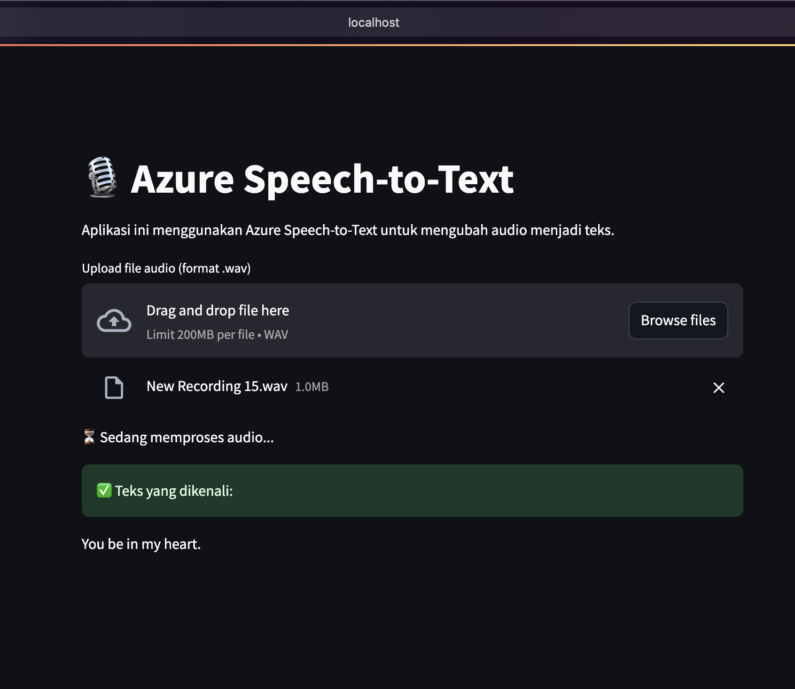

# 🎙️👄 **Azure AI Services** - <span style="background: linear-gradient(to right, #5DC4F7, #FF87E1); -webkit-background-clip: text; color: transparent;">Membuat Web dengan Azure AI Text-to-Speech</span>

Relevan (April 2025)

<!--  -->


# 🎯 Tujuan Tutorial:

Membuat aplikasi web menggunakan Streamlit yang terintegrasi dengan Azure AI Services, seperti Speech-to-Text.

# 🛠️ Prasyarat

**‼️ Sebelum mulai, pastikan kamu punya:**
1. **Azure Subscription** – Bisa daftar di https://azure.microsoft.com/free
2. **Python 3.8** atau lebih baru
3. **Visual Studio Code** - (opsional)
4. **Pemahaman dasar Python** - (variabel, fungsi, class)
5. **Pemahaman dasar Web** - HTML & CSS

<br>

# 🧱 Struktur Tutorial
1.	### <span style="color:#5DC4F7">**Persiapan Azure AI Service**</span>
<!-- 2.  ### <span style="color:#5DC4F7">**Speech Service Configuration**</span> -->
2.	### <span style="color:#5DC4F7">**Menyiapkan Virtual Environment**</span>
3.  ### <span style="color:#5DC4F7">**Membuat Aplikasi Streamlit**</span>

<br>

# 📝 Tutorial
## 📌 1. <span style="color:#5DC4F7">Persiapan Azure AI Service</span>
- ### <span style="color:#E8BEE6">Masuk ke Portal Azure
    - **Buka browser** dan masuk ke **https://portal.azure.com**
    - **Login** menggunakan akun Microsoft yang punya langganan Azure (Free tier bisa juga digunakan).
- ### <span style="color:#E8BEE6">Buat Resource Baru
    - Klik tombol <span style="color:#FF87E1">**Create a resource**</span> (biasanya ada di pojok kiri atas).

        
    
    - Di kolom pencarian, ketik Azure AI Services.	
    - Pilih <span style="color:#FF87E1">**Azure AI Services**</span> yang bergambar <span style="color:#5DC4F7">**awan biru**</span> dari hasil pencarian.

        
    
    - Klik tombol <span style="color:#FF87E1">**Create**</span>.
- ### <span style="color:#E8BEE6">Isi Formulir Konfigurasi
    | Field | Penjelasan |
    |-------|------------|
    | Subscription | Pilih subscription yang aktif (Azure for Students)|
    | Resource Group | Pilih resource group yang sudah ada atau buat baru (misalnya: rg-aiservices-demo) |
    | Region | Pilih East US (karena ini region default yang mendukung OpenAI)|
    | Name | Nama unik untuk resource, misalnya: aiservices-demo-ugm |
    | Pricing tier | Pilih Standard S0 |
    | Terms & Conditions | Centang cekbox nya |
            
    
    
    - Setelah semua terisi → klik <span style="color:#FF87E1">**Review + Create**</span>, tunggu validasi selesai, lalu klik <span style="color:#FF87E1">**Create**</span>.

        

- ### <span style="color:#E8BEE6">Tunggu Proses Deployment ⏳
    - Tunggu sekitar 1–3 menit hingga proses deployment selesai.
    - Setelah selesai, klik <span style="color:#FF87E1">**Go to Resource**</span> untuk masuk ke halaman resource Azure OpenAI kamu.

        

- ### <span style="color:#E8BEE6">Simpan Key dan Region
    - Pada menu sidebar kiri, klik <span style="color:#FF87E1">**Keys and Endpoints**</span>
    - Lalu akan muncul Key dan Region, lalu simpan kredential tersebut karena kita akan menggunakannya.

        

<br>

<!-- ## 📌 2. <span style="color:#5DC4F7">Speech Service Configuration</span>
- ### <span style="color:#E8BEE6">Menyiapkan Text-to-Speech

<br> -->

## 📌 2. <span style="color:#5DC4F7">Menyiapkan Virtual Environment</span>
- ### <span style="color:#E8BEE6">Setup Python Virtual Environment
    - Buka Visual Studio Code dan buat file kosong.
    - Pilih folder kosong lalu buka <span style="color:#FF87E1">**command prompt / terminal**</span> dengan menekan <span style="color:#FF87E1">**Ctrl + `**</span>.
    - Install dan aktifkan virtual environment. Copy-paste satu persatu kode dibawah.
        ```bash
        python -m venv venv
        source venv/bin/activate  # Untuk Linux/Mac
        venv\Scripts\activate     # Untuk Windows
    - Kita akan menginstall *library dependencies* termasuk framework **Streamlit**. 
    - Buat file baru diluar folder `venv/` bernama <span style="color:#FF87E1">**requirements.txt**</span> yang berisikan:
        ```bash
        streamlit
        azure
        azure-cognitiveservices-speech
        streamlit-extras
    - Setelah itu, pada terminal yang sama, ketik:
        ```bash
        pip install -r requirements.txt
    - Dengan begitu, kita dapat menginstall semua *library dependencies* dalam sekali perintah.
    - Buat file python 🐍 bernama `speech-to-text.py`.
    - Buat folder bernama .streamlit dan file di dalamnya secrets.toml
    - Isikan file secrets.toml seperti ini:
        ```bash
        [azure]
        key = "YOUR_AZURE_SECRET_KEY"
        region = "YOUR_AZURE_REGION"
    - Struktur File yang diharapkan:
        ```bash
        Azure AI Services - Web with Azure AI Services/
        ├── .streamlit/
        │   └── secrets.toml       # File untuk menyimpan key dan region
        ├── venv/                  # Python Virtual Environment
        ├── speech-to-text.py      # File kode aplikasi Streamlit
        └── requirements.txt       # File dependencies

<br>

## 📌 3. <span style="color:#5DC4F7">Membuat Aplikasi Streamlit</span>
- ### <span style="color:#E8BEE6">Membuat File Streamlit
    - Buat file Python bernama `speech-to-text.py` di luar folder `venv/`.
    - Tambahkan kode berikut untuk membuat aplikasi Streamlit sederhana yang menggunakan Azure Speech-to-Text:

        ```python
        # filepath: speech-to-text.py
        import streamlit as st
        from azure.cognitiveservices.speech import SpeechConfig, SpeechRecognizer, AudioConfig, ResultReason

        # Konfigurasi Azure
        azure_key = st.secrets["azure"]["key"]
        azure_region = st.secrets["azure"]["region"]

        # Judul aplikasi
        st.title("🎙️ Azure Speech-to-Text")
        st.write("Aplikasi ini menggunakan Azure Speech-to-Text untuk mengubah audio menjadi teks.")

        # Upload file audio
        uploaded_file = st.file_uploader("Upload file audio (format .wav)", type=["wav"])

        if uploaded_file is not None:
            # Simpan file audio sementara
            with open("temp_audio.wav", "wb") as f:
                f.write(uploaded_file.getbuffer())

            # Konfigurasi Azure Speech-to-Text
            speech_config = SpeechConfig(subscription=azure_key, region=azure_region)
            audio_config = AudioConfig(filename="temp_audio.wav")
            recognizer = SpeechRecognizer(speech_config=speech_config, audio_config=audio_config)

            st.write("⏳ Sedang memproses audio...")
            result = recognizer.recognize_once()

            # Tampilkan hasil
            if result.reason == ResultReason.RecognizedSpeech:
                st.success("✅ Teks yang dikenali:")
                st.write(result.text)
            else:
                st.error(f"❌ Gagal mengenali audio. Alasan: {result.reason}")
        ```

- ### <span style="color:#E8BEE6">Menjalankan Aplikasi
    - Jalankan aplikasi Streamlit dengan perintah berikut di terminal:
        ```bash
        streamlit run speech-to-text.py
        ```
    - Aplikasi akan terbuka di browser pada alamat `http://localhost:8501`.

- ### <span style="color:#E8BEE6">Menggunakan Aplikasi
    - Upload file audio dalam format `.wav`.
    - Tunggu hingga proses selesai, dan teks hasil transkripsi akan ditampilkan di layar.

        

<br>

# 🎉 **Selesai!**
Anda telah berhasil membuat aplikasi web menggunakan Streamlit yang terintegrasi dengan Azure AI Services untuk Speech-to-Text. Anda dapat mengembangkan aplikasi ini lebih lanjut dengan menambahkan fitur seperti Text-to-Speech, pengaturan bahasa, antarmuka pengguna yang lebih menarik, atau dan bahkan menggabungkan fitur Text-to-Speech dengan <span style="background: linear-gradient(to right, #5DC4F7, #FF87E1); -webkit-background-clip: text; color: transparent;">**ChatGPT untuk Tanya Jawab**</span> 💬 🤖.