# 🤖 **Azure Open AI API** - <span style="background: linear-gradient(to right, #5DC4F7, #FF87E1); -webkit-background-clip: text; color: transparent;">Aplikasi AI dengan Azure Open AI & Azure AI Studio</span>

Relevan April 2025

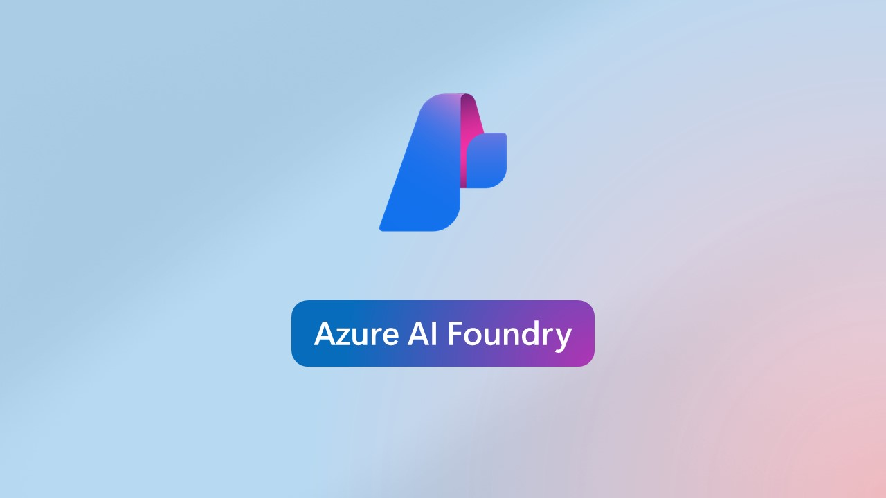

# 🎯 Tujuan Tutorial:

Membuat aplikasi AI (misalnya chatbot atau teks generator) menggunakan layanan Azure OpenAI melalui Azure AI Studio dan mengaksesnya menggunakan API.

# 🛠️ Prasyarat

**‼️ Sebelum mulai, pastikan Anda punya:**
1. **Azure Subscription** – Bisa daftar di https://azure.microsoft.com/free
2. **Akses ke Azure OpenAI** (harus disetujui terlebih dahulu)
3. **Azure AI Studio** – tersedia dari portal Azure (https://ai.azure.com/)

<br>

# 🧱 Struktur Tutorial
1.	### <span style="color:#5DC4F7">**Buat Resource Azure OpenAI**</span>
2.	### <span style="color:#5DC4F7">**Gunakan Azure AI Studio untuk Membangun Prompt**</span>

<br>

# 📝 Tutorial
## 📌 1. <span style="color:#5DC4F7">Buat Resource Azure OpenAI</span>
- ### <span style="color:#E8BEE6">Masuk ke Portal Azure
    - **Buka browser** dan masuk ke **https://portal.azure.com**
    - **Login** menggunakan akun Microsoft yang punya langganan Azure (Free tier bisa juga digunakan).
- ### <span style="color:#E8BEE6">Buat Resource Baru
    - Klik tombol <span style="color:#FF87E1">**Create a resource**</span> (biasanya ada di pojok kiri atas).

        
    
    - Di kolom pencarian, ketik Azure OpenAI.	
    - Pilih <span style="color:#FF87E1">**Azure OpenAI**</span> dari hasil pencarian.

        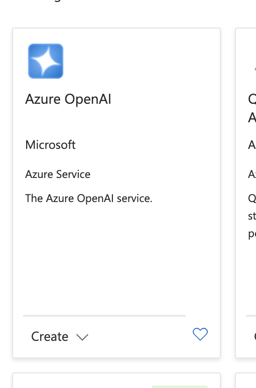
    
	- Klik tombol <span style="color:#FF87E1">**Create**</span>.
- ### <span style="color:#E8BEE6">Isi Formulir Konfigurasi
    | Field | Penjelasan |
    |-------|------------|
    | Subscription | Pilih subscription yang aktif |
    | Resource Group | Pilih resource group yang sudah ada atau buat baru (misalnya: rg-openai-demo) |
    | Region | Pilih East US (karena ini region default yang mendukung OpenAI)|
    | Name | Nama unik untuk resource, misalnya: openai-demo-ugm |
    | Pricing tier | Pilih Standard S0 |
            
    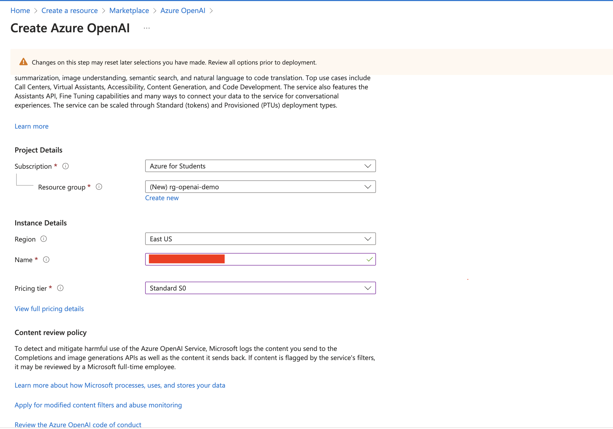
    
    - Setelah semua terisi → klik <span style="color:#FF87E1">**Review + Create**</span>, tunggu validasi selesai, lalu klik <span style="color:#FF87E1">**Create**</span>.

        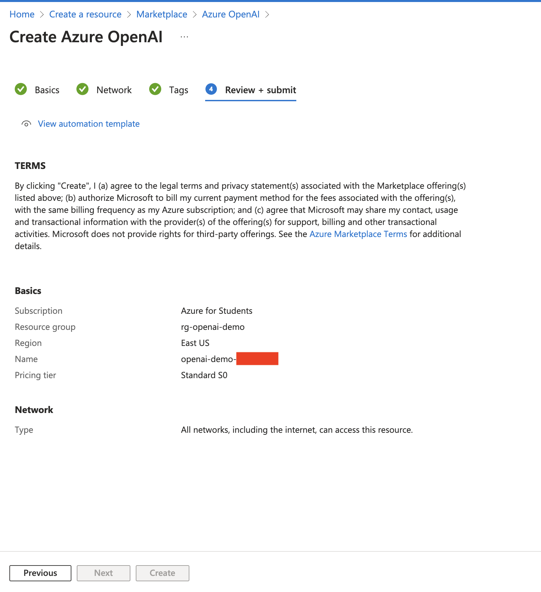

- ### <span style="color:#E8BEE6">Tunggu Proses Deployment ⏳
    - Tunggu sekitar 1–3 menit hingga proses deployment selesai.
	- Setelah selesai, klik <span style="color:#FF87E1">**Go to Resource**</span> untuk masuk ke halaman resource Azure OpenAI Anda.

        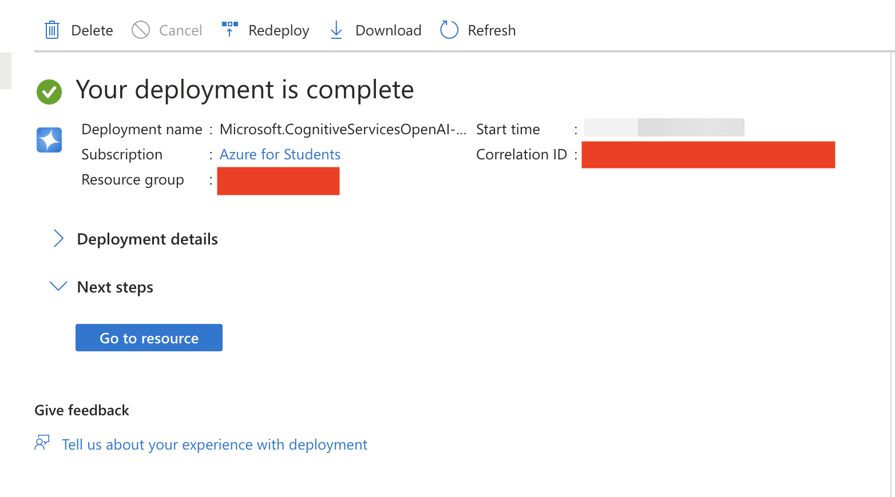

- ### <span style="color:#E8BEE6">(Opsional) Verifikasi Akses ke Model
    https://learn.microsoft.com/en-us/legal/cognitive-services/openai/limited-access?source=docs


<br>

## 📌 2. <span style="color:#5DC4F7">Gunakan Azure AI Studio untuk Membangun Prompt</span>
### 🎯 Tujuan:

Menguji dan menyusun <span style="color:#5DC4F7">**prompt**</span> (perintah teks ke AI model seperti GPT-3.5/4) di antarmuka visual tanpa perlu coding dulu. Cocok untuk eksplorasi, testing, dan simulasi AI behavior.

Berikut langkah-langkahnya:

- ### <span style="color:#E8BEE6">Buka Azure AI Studio
    - Akses: **https://ai.azure.com**
    - Login dengan akun Microsoft Anda (sama dengan akun Azure tadi).
    - Setelah masuk, Anda akan melihat tampilan Azure AI Studio.

        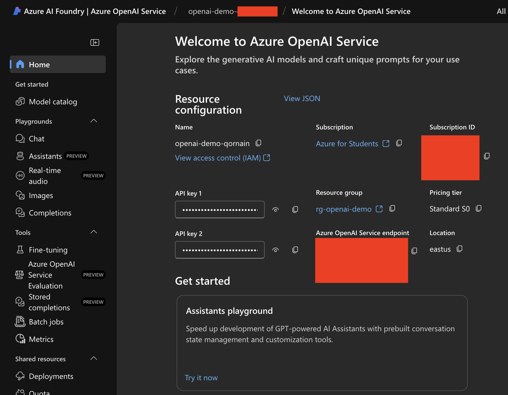

- ### <span style="color:#E8BEE6">Siapkan model catalog
    - Di sidebar kiri, klik menu <span style="color:#FF87E1">**Model catalog**</span>.
    - Untuk keperluan demo kali ini, digunakan model dengan biaya murah dan performa cukup bagus, yaitu `gpt-35-turbo`.
    - Cari dan pilih model `gpt-35-turbo`.
    - Klik <span style="color:#FF87E1">**Deploy**</span>.

        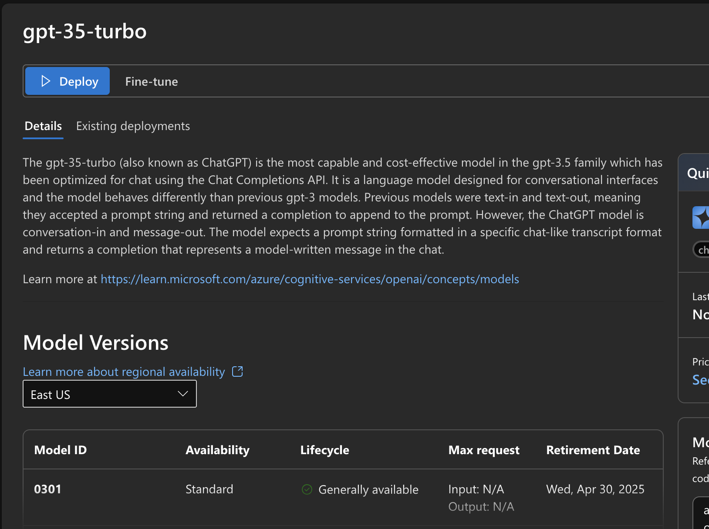

    - Setelah dipastikan benar, klik <span style="color:#FF87E1">**Create resource and deploy**</span>.

        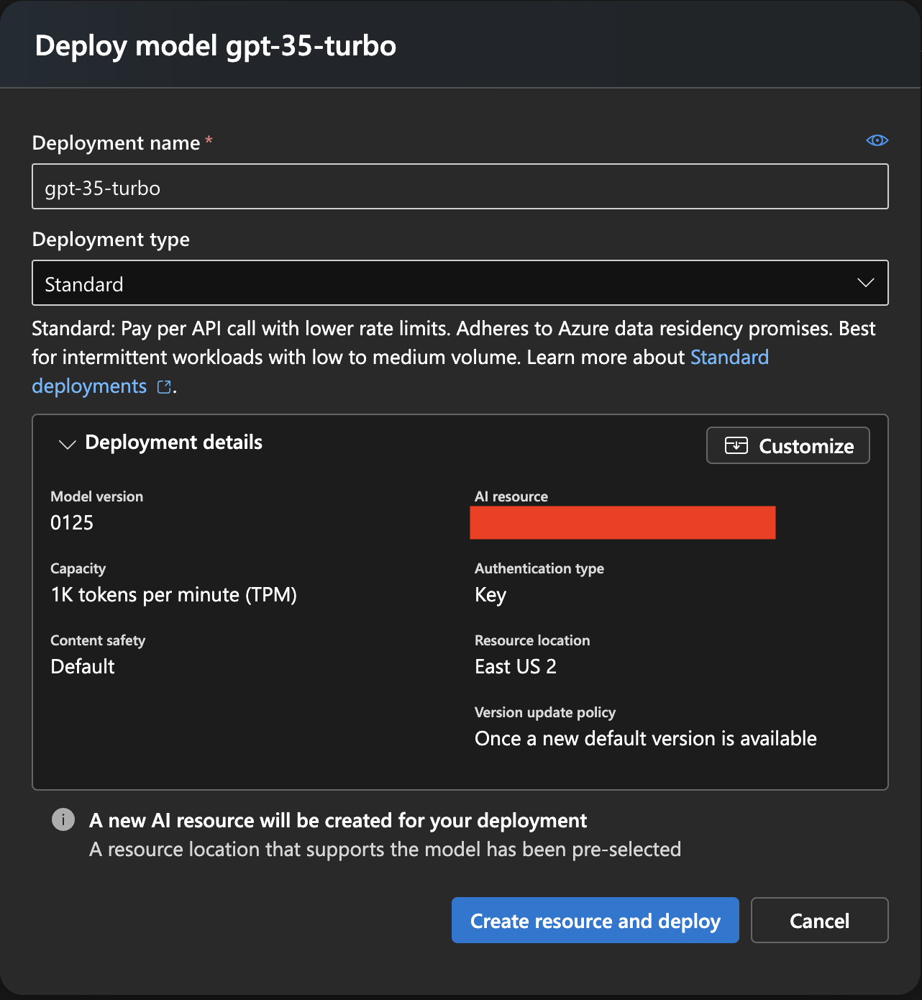

    - Jika sudah selesai, maka akan dialihkan ke menu <span style="color:#FF87E1">**Deployments**</span> yang berisikan *credential* dari model yang telah di deploy.

- ### <span style="color:#E8BEE6">Masuk ke “Chat playground” 💬
    - Di sidebar kiri, klik menu <span style="color:#FF87E1">**Playground**</span>
    - Pilih <span style="color:#FF87E1">**Chat**</span>
    - Pilih model yang sudah dideploy tadi `(gpt-35-turbo)`

        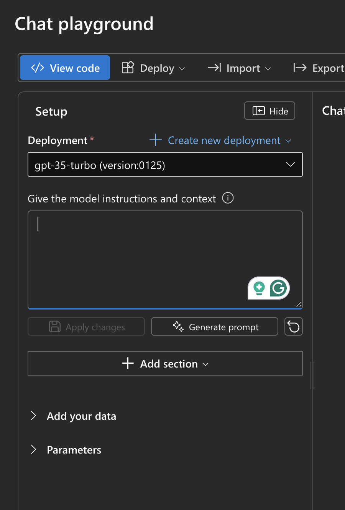
    
    - Jika pilihan model tidak ada, ulangi langkah <span style="color:#E8BEE6">**Siapkan model catalog**</span>.

- ### <span style="color:#E8BEE6">Tulis Prompt
    - Di halaman tersebut ada 2 bagian:
        - <span style="color:#FF87E1">**Give the model instructions and context**</span> - Digunakan untuk mengatur kepribadian dan peran AI.
        - <span style="color:#FF87E1">**User Query**</span> - Diisi saat chat dimulai (simulasi input user).

        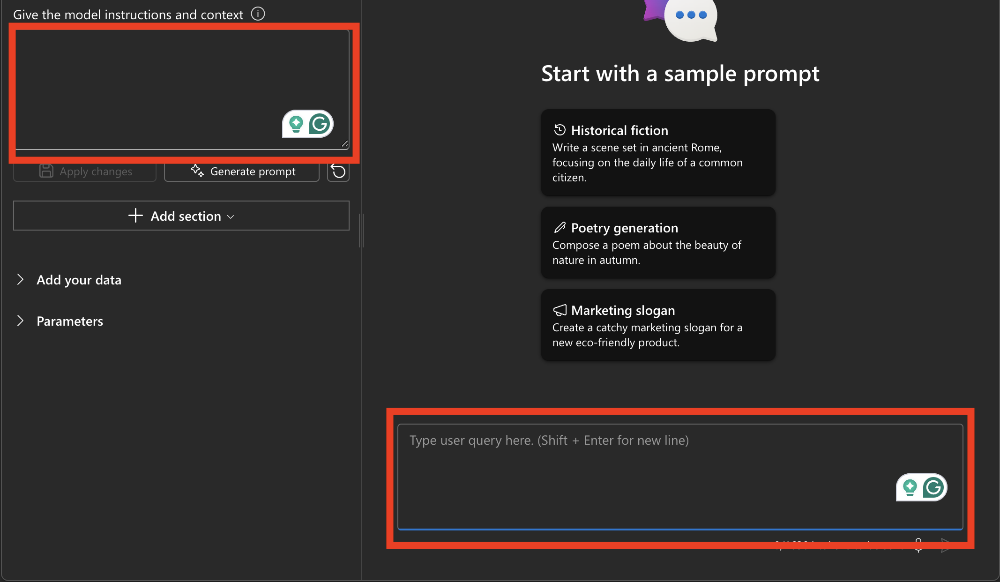
    - Masukkan contoh prompt berikut pada <span style="color:#FF87E1">**Give the model instructions and context**</span>:
        ```bash
        Anda adalah guru matematika yang sabar dan menjelaskan konsep dengan sederhana.    
    - Lalu klik 💾 <span style="color:#FF87E1">**Apply Changes**</span>.
    
    - Masukkan contoh user query berikut pada <span style="color:#FF87E1">**User Query**</span>:
        ```bash
        Tolong jelaskan apa itu integral dalam kalkulus.
    - Setelah itu klik icon <span style="color:#FF87E1">**Send**</span>
    - Akan muncul hasil dari jawabannya:
        
        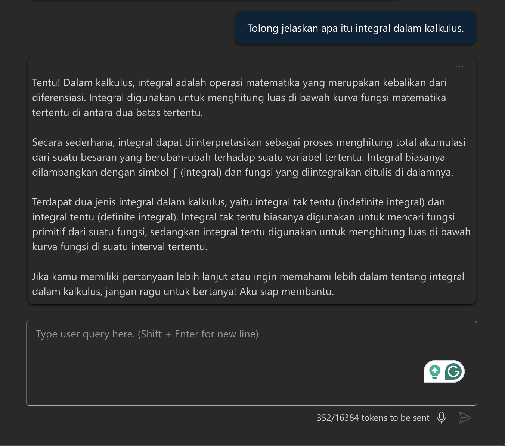

<br>

# 🎉 **Selesai!**
Anda telah menyelesaikan tutorial **Azure Open AI API** - <span style="background: linear-gradient(to right, #5DC4F7, #FF87E1); -webkit-background-clip: text; color: transparent;">Aplikasi AI dengan Azure Open AI & Azure AI Studio</span>. Pelajari fitur-fitur dan implementasi lebih lanjut di: 

https://learn.microsoft.com/en-us/azure/ai-foundry/what-is-azure-ai-foundry

### Selamat Mencoba 🎉👑

<!-- ## 📌 3. Deploy Model dan Dapatkan Endpoint API
Secara tidak langsung, pada taham kedua sebelunya, sudah dilakukan Deploy model. Kita hanya perlu mendapatkan Endpoint API nya saja.
- Pada sidebar kiri, klik <span style="color:#FF87E1"> -->
    